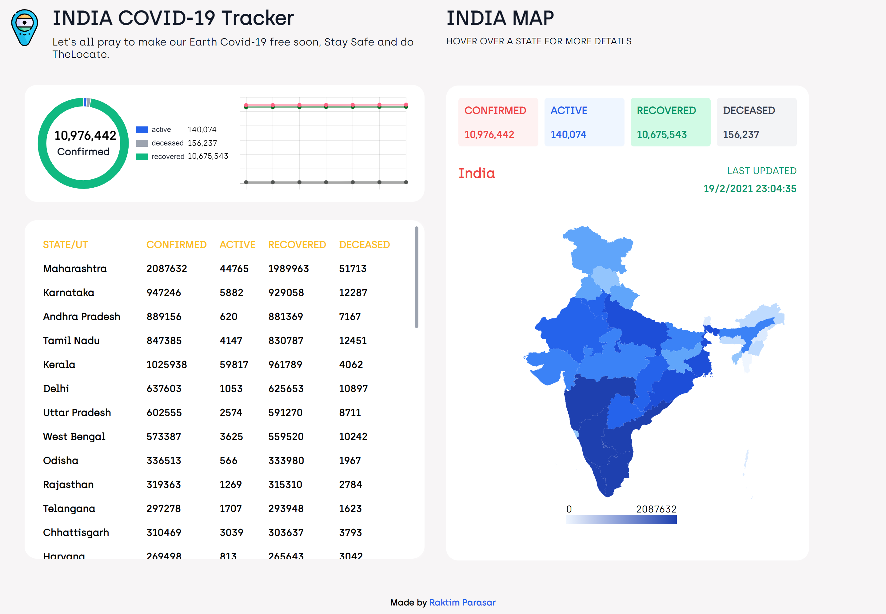

# Covid-19 India Dashboard

This project was bootstrapped with [Create React App](https://github.com/facebook/create-react-app).

## Screenshots

### How to run

1. Clone the project `git clone https://github.com/RaktimParasar/India-Covid_19-Tracker.git`
2. Move to project folder `cd india-covid_19-Tracker`
3. Install dependencies `npm install`
4. Start Dev server `npm start`
5. Browse http://localhost:3000/

### API data

The real-time data is fetched from [here](https://api.covid19india.org/data.json).
